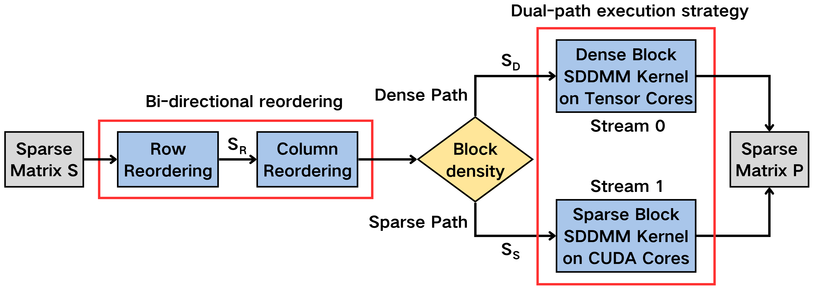
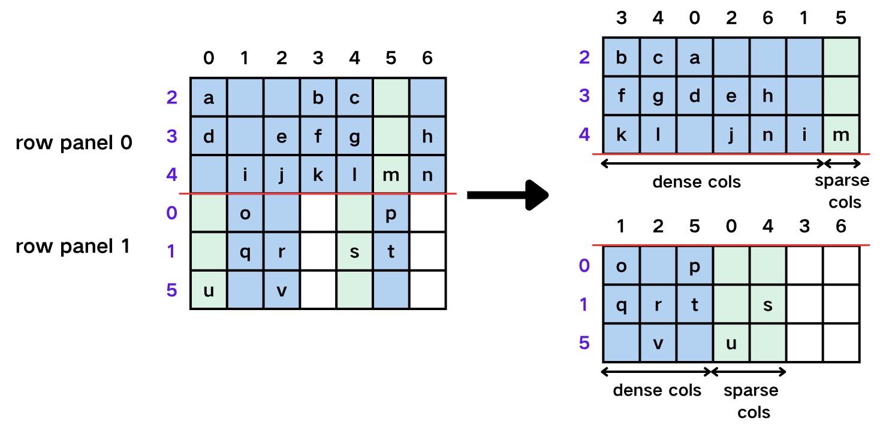

# BSMR-SDDMM

Official implementation for the paper:

**Block-structured matrix reordering for efficient SDDMM on tensor cores**

Published in *The Journal of Supercomputing*, Volume 82, Article 465, 2026.

- Paper: https://link.springer.com/article/10.1007/s11227-026-08606-2
- DOI: 10.1007/s11227-026-08606-2
- Authors: Chengxing Zou, Changwan Hong, Gordon Euhyun Moon, and Jinsung Kim

## Overview

This project implements **BSMR**, a block-structured matrix reordering framework for accelerating Sampled Dense-Dense Matrix Multiplication (SDDMM) on NVIDIA Tensor Cores. SDDMM computes:

$$
\mathbf{P}_{ij} = (\mathbf{A} \cdot \mathbf{B})_{ij} \cdot \mathbf{S}_{ij}, \quad \text{only if} \quad \mathbf{S}_{ij} > 0
$$

BSMR accelerates SDDMM by reorganizing sparse matrices into denser block structures through bidirectional row and column reordering. Sparse and irregular memory accesses make it difficult to fully utilize Tensor Cores for SDDMM. Dense tiles are assigned to Tensor Cores, while sparse tiles are handled by CUDA Cores through a hybrid execution strategy.



The overall workflow first reorders the sparse matrix to expose block-level locality, then classifies tiles according to their density. Tiles with enough nonzeros are processed by the Tensor Core path, and the remaining sparse tiles are processed by the CUDA Core path. This dual-path design balances dense-block acceleration and sparse-pattern flexibility.



The reordering procedure operates on both rows and columns. After row reordering groups rows with similar sparsity patterns, column reordering is applied inside row panels to further concentrate nonzeros into compact tiles. This produces block-structured sparse regions that better match the tile-based execution model of Tensor Cores.

## Benchmarks

Paper results were measured on an NVIDIA GeForce RTX 4090; numbers may vary on other GPUs or software versions.

### Results

Experiments on an NVIDIA GeForce RTX 4090 (CUDA $\ge$ 12.0, SuiteSparse matrices, $K=128$) show that BSMR achieves:

- Up to **10.38×** speedup over the best Tensor Core baseline (FlashSparse)
- Up to **7.31×** speedup over the best CUDA Core baseline (RoDe)

### Reproduce Paper Figures

Pre-stored benchmark logs are included under `scripts/results_suiteSparse_dataset/`. To regenerate the paper figures directly:

```shell
cd scripts/
bash plot_fig_7.sh
bash plot_fig_8.sh
bash plot_fig_9.sh
bash plot_fig_10.sh
bash plot_fig_11.sh
```

### Full Benchmark

To rerun all experiments from scratch (baselines, BSMR, and BSA on the full SuiteSparse dataset; may take many hours):

```shell
cd scripts/
bash build_program.sh && bash build_TCGNN.sh && bash build_FlashSparse.sh
bash download_suiteSparse_dataset.sh
python exclude_invalid_dataset.py suiteSparse_dataset/
bash run_all.sh
```

Then run the plotting scripts above.

## Build Requirements

- C++ compiler with C++17 support
- CUDA Toolkit $\ge$ 12.0
- OpenMP
- cmake $\ge$ 3.26
- NVIDIA GPU with Tensor Core support, compute capability >= 8.0

The experiments in the paper were conducted on an NVIDIA GeForce RTX 4090. The default CMake configuration targets `sm_89`; update `CMAKE_CUDA_ARCHITECTURES` if you build on a different GPU architecture.

## Build

Linux:

```shell
mkdir -p build
cmake -S . -B build
cmake --build build -j
```

## Run

Options:

- `-f`: Input file path
- `-k`: K value. K must be a multiple of 32 (Default 32)
- `-a`: Row similarity threshold alpha (Default 0.3)
- `-d`: Block density threshold delta (Default 0.3)

Example:

```shell
./BSMR-sddmm -f ../dataset/nips.mtx -k 128
```

or

```shell
./BSMR-sddmm ../dataset/nips.mtx 128
```

## Input Format

The implementation supports the [Matrix Market](https://sparse.tamu.edu/about) input format (suffix: `.mtx`).

## Citation

If you use this code or find this work useful, please cite:

```bibtex
@article{zou2026block,
  title={Block-structured matrix reordering for efficient SDDMM on tensor cores},
  author={Zou, Chengxing and Hong, Changwan and Moon, Gordon Euhyun and Kim, Jinsung},
  journal={The Journal of Supercomputing},
  volume={82},
  article={465},
  year={2026},
  doi={10.1007/s11227-026-08606-2},
  url={https://doi.org/10.1007/s11227-026-08606-2}
}
```
